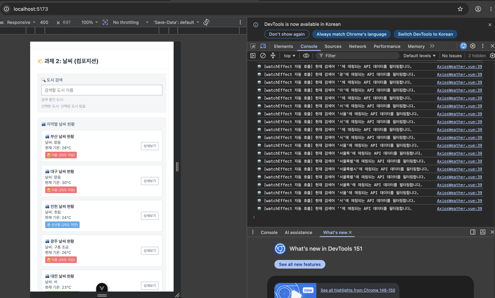

# SKALA Vue 학습 프로젝트

Vue 3와 Vite를 활용한 학습·실습 프로젝트입니다.

## 1일차 · 학습 환경 설정

- Vue 3 + Vite 프로젝트 생성
- Vue Router, Pinia 기본 구성
- 개발 서버 실행 및 프로젝트 구조 확인

```sh
npm install
npm run dev
```

## 2일차 · Vue 기본 문법 실습

- 반응성 데이터와 텍스트 보간법
- Vue Directive
  - `v-html`, `v-text`, `v-bind`, `v-if`, `v-show`, `v-for`
  - `v-pre`, `v-cloak`, `v-once`, `v-memo`
- 이벤트 처리
  - `v-on`, 이벤트 객체, 이벤트 수식어
- 폼 처리
  - `v-model`, HTML Form 요소 바인딩, `v-model` 수식어
- Scoped 스타일 및 외부 CSS 활용

각 문법 예제는 `src/components/practices/basic/`에 있습니다. `/practices` 경로에서 예제를 선택해 실행할 수 있습니다.

## 2일차 실습 과제 · Weather Mockup

홈(`/`)에서 다음 기능을 구현했습니다.

- 대한민국 광역시 6곳의 날씨 목 데이터를 `v-for`와 `:key`로 렌더링
- 기온 25°C 기준으로 더움/선선함 라벨을 조건부 렌더링
- 도시명 한글 검색 (`v-model`)
- 카드 클릭 선택 알림과 상세보기 버튼의 이벤트 전파 차단 (`.stop`)
- 데이터 추가 기능은 다음 단계에서 구현 예정

## 3일차 · Composition API 실습

기존 Weather Mockup을 Composition API로 발전시켰습니다.

- `ref()`로 검색어, 선택 도시, 날씨 목록 상태 관리
- `computed()`를 활용한 도시명 실시간 검색 (`filteredWeatherList`)
- `watch()`로 선택 상태 문구와 선택 도시 변경 감시
- `watchEffect()`로 검색어 변경 자동 감시
- 검색 결과가 없을 때 안내 문구 출력



## 4일차 · Vue Router 실습

Weather Component 대시보드를 Vue Router 기반으로 전환했습니다.

- 라우트 지연 로딩과 Catch-all Route 적용
- `RouterLink`, `RouterView` 기반 내비게이션 바 구성
- 검색어를 URL 쿼리(`search`)와 동기화
- 상세보기 버튼을 `/weather/:cityId` 동적 경로 이동으로 변경
- 도시별 Mock 상세 날씨 정보 화면과 서비스 소개 화면 작성
- 추가 view: 라우터 동작을 정리한 `/guide` 학습 안내 화면 작성

## 명령어

```sh
# 개발 서버
npm run dev

# 프로덕션 빌드
npm run build

# 린트
npm run lint
```
